# 📊 Evolução de Casos e Mortes no Brasil

## 🔍 O que foi feito
Foi gerado um gráfico de linhas com séries temporais referentes à evolução da pandemia no Brasil:

- `new_cases_smoothed:` número de novos casos de COVID-19 suavizados por média móvel (7 dias);

- `new_deaths_smoothed:` número de novas mortes diárias também suavizadas pela média móvel.

A suavização das séries reduz o efeito de flutuações diárias e melhora a visualização de tendências e padrões ao longo do tempo.

## 📈 Principais Insights
1. **Múltiplas Ondas de Contágio**

O gráfico evidencia diversas ondas epidêmicas no Brasil entre 2020 e 2023:

   - A primeira onda, em meados de 2020, mostra um crescimento progressivo de casos e mortes.

   - A segunda onda, no primeiro semestre de 2021, foi mais intensa e letal, associada à variante Gama (P.1), originária de Manaus.

   - A terceira onda, no início de 2022, apresenta o maior pico de novos casos — fortemente vinculado à variante Ômicron. Apesar do recorde de infecções, as mortes não acompanharam na mesma 
     proporção, o que indica menor letalidade ou maior proteção vacinal.

2. **Descompasso entre Casos e Mortes**

Observa-se um atraso temporal entre os picos de casos e os de mortes, geralmente de algumas semanas. Esse comportamento é esperado devido à progressão natural da doença e tempo de agravamento clínico.

3. **Impacto da Vacinação (Pós-2021)**

Após o segundo semestre de 2021, nota-se que os picos de mortes diminuem consideravelmente, mesmo diante de novas ondas de contágio — evidenciando o impacto positivo da vacinação em massa.

4. **Tendência de Queda e Estabilização**

A partir do final de 2022 até 2024, a curva de novos casos e, principalmente, de mortes tende à estabilidade e baixos valores. Isso pode indicar o controle epidêmico, possivelmente sustentado por imunidade populacional (vacinal e natural) e mudanças no comportamento coletivo.
## 🧠 Conclusões Gerais
- A evolução da pandemia no Brasil apresenta padrões típicos de surtos sucessivos, impulsionados por novas variantes e oscilações no controle sanitário.

- A segunda onda foi a mais crítica em termos de mortalidade, exigindo respostas urgentes do sistema de saúde.

- A vacinação se consolidou como um divisor de águas, reduzindo expressivamente os óbitos mesmo diante de surtos com maior número de infectados.

- A curva demonstra a importância da vigilância contínua, políticas públicas ágeis e investimento em ciência, vacinação e comunicação pública durante crises sanitárias.

# 📊 Evolução da Vacinação no Brasil

## 🔍 O que foi feito
Foi criado um gráfico de linha apresentando a evolução da métrica:

- `people_fully_vaccinated_per_hundred:` percentual da população brasileira com vacinação completa contra a COVID-19, por 100 habitantes.

O eixo horizontal representa o tempo (datas entre o início de 2021 até o início de 2023), enquanto o eixo vertical indica o percentual de cobertura vacinal. A visualização tem como objetivo monitorar a progressão da campanha de vacinação ao longo do tempo.

## 📈 Principais Insights
1. **Início Lento da Campanha Vacinal (Q1 e Q2 de 2021)**

Observa-se um crescimento bastante modesto no início da série (janeiro a abril de 2021), indicando que a campanha de vacinação começou de forma lenta — possivelmente devido à limitação de doses disponíveis e priorização por grupos de risco.

2. **Aceleração Significativa (Q3 de 2021)**
 
A partir de julho de 2021, nota-se uma curva acentuada de crescimento. Esse período marca a ampliação da vacinação para a população adulta em geral, com maior disponibilidade de doses e centros de vacinação.

3. **Pico de Crescimento e Saturação (Q4 de 2021 a Q2 de 2022)**
   
Entre setembro de 2021 e abril de 2022, a cobertura vacinal ultrapassa os 70%, chegando a cerca de 80% da população vacinada com o esquema completo. Após esse ponto, a curva se torna cada vez mais horizontal, indicando uma saturação na adesão vacinal — as pessoas que desejavam se vacinar já o fizeram.

4. **Estabilização e Estagnação (Após Q2 de 2022)**
   
A partir de meados de 2022 até o início de 2023, a taxa de vacinação praticamente não se altera, ficando em torno de 81%–82%. Isso pode indicar resistência vacinal, falta de campanhas ativas, ou barreiras logísticas para vacinação em populações remanescentes.

## 🧠 Conclusões Gerais
- A vacinação no Brasil apresentou um ritmo inicial lento, seguido de uma forte aceleração, atingindo níveis elevados de cobertura (acima de 80%) até meados de 2022.

- A curva evidencia um modelo típico de adesão populacional a campanhas massivas, com crescimento exponencial seguido de saturação.

- O alcançar de um platô vacinal pode ter sido influenciado por fatores como hesitação vacinal, desinformação ou dificuldades logísticas.

- A curva mostra que, apesar dos desafios iniciais, o Brasil conseguiu vacinar a maior parte da população — o que contribuiu significativamente para o controle da pandemia e redução de mortes a partir da segunda metade de 2021.

# 📊 Vacinação X Mortes no Brasil

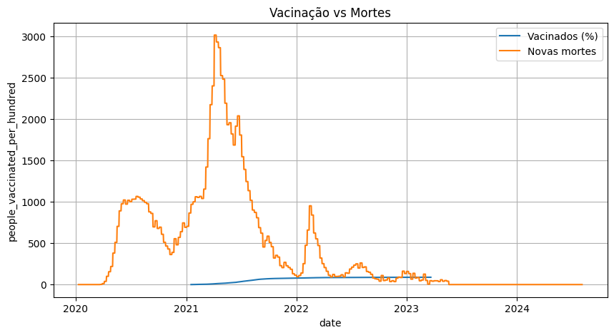

## 🔍 O que foi feito
Foi gerado um gráfico de linha com a comparação temporal entre:

- `people_vaccinated_per_hundred:` percentual da população brasileira vacinada (ao menos uma dose);

- `new_deaths_smoothed:` número de novas mortes diárias por COVID-19, suavizadas por média móvel (7 dias).

O gráfico possibilita observar a correlação temporal entre o avanço da vacinação e a redução na mortalidade.

## 📈 Principais Insights
1. **Vacinação Inicia Após Primeiras Ondas**

A curva de vacinação inicia-se no começo de 2021, quando o país já havia enfrentado duas grandes ondas de mortes, com picos expressivos antes mesmo de qualquer cobertura vacinal relevante.

2. **Redução de Mortes com Aumento da Vacinação**

A partir do momento em que a população vacinada ultrapassa 20%–40%, nota-se uma redução progressiva e consistente no número de mortes, mesmo com a presença de novos picos de casos (observados em análises anteriores).

3. **Efeito da Imunização em Massa**

A fase de maior crescimento da curva de vacinação coincide com a queda mais acentuada da mortalidade, especialmente no segundo semestre de 2021 — evidenciando um efeito protetivo direto da imunização.

4. **Picos Posteriores com Menor Letalidade**

Em 2022, mesmo com surtos identificáveis em casos (não exibidos aqui), os picos de mortes são notadamente menores — sinalizando possível dissociação entre infecção e letalidade devido à vacinação, variantes menos agressivas (como a Ômicron), e maior preparo clínico.

## 🧠 Conclusões Gerais
- O gráfico corrobora a eficácia das vacinas na prevenção de mortes, sendo um indicativo robusto do impacto positivo da imunização em massa.

- A inversão de tendência entre as curvas (subida da vacinação e queda de mortes) reforça a necessidade de campanhas públicas bem estruturadas e políticas de saúde baseadas em evidências.

- Este tipo de análise pode ser um instrumento de comunicação estratégica em saúde pública para combater hesitação vacinal, utilizando dados visuais para demonstrar impactos concretos.

- A continuidade da vigilância epidemiológica e reforço de doses podem ser fundamentais para manter os níveis de mortalidade baixos em futuras ondas epidêmicas.

# 📊 Ocupação Média de UTIs por COVID-19

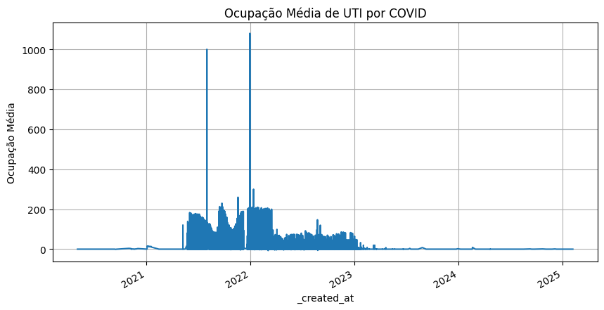

## 🔍 O que foi feito
Foi gerado um gráfico de barras com a série temporal da variável:

- `ocupacao_hospital.groupby('_created_at')['ocupacaoCovidUti'].mean().dropna():` representando a média diária de leitos ocupados em Unidades de Terapia Intensiva por pacientes com COVID.

O eixo horizontal representa as datas (_created_at), entre 2020 e 2025, enquanto o eixo vertical indica o número médio de leitos ocupados por dia.

## 📈 Principais Insights
1. **Baixa Ocupação no Início da Pandemia**

Até meados de 2020, observa-se uma ocupação baixa e instável, refletindo os primeiros estágios da pandemia, quando os casos ainda estavam se espalhando gradualmente.

2. **Picos Críticos em 2021 e 2022**

Entre 2021 e 2022, há picos intensos de ocupação com valores que ultrapassam 200 e até 1000 leitos ocupados em determinados dias. Esses picos correspondem aos períodos mais críticos da pandemia:

   - O primeiro grande pico coincide com a segunda onda da COVID-19 no Brasil, impulsionada pela variante Gama.

   - O segundo pico, ainda mais acentuado, está possivelmente associado à variante Ômicron, com alta transmissibilidade.

3. **Queda Progressiva Pós-2022**

A partir do segundo semestre de 2022, observa-se uma queda consistente da ocupação média de UTIs, que se mantém próxima de zero ao longo de 2023 e 2024. Essa tendência está fortemente associada:

   - ao avanço da vacinação em massa;

   - à maior capacidade de resposta hospitalar;

   - e à redução da gravidade clínica nas novas variantes.

4. **Valores Atípicos/Anômalos**

Os dois picos acima de 1000 chamam atenção e podem indicar erros de registro ou consolidação de dados acumulados em um único dia, devendo ser investigados como possíveis outliers.

## 🧠 Conclusões Gerais
- O gráfico evidencia a pressão extrema sobre o sistema de saúde brasileiro durante os períodos críticos da pandemia, com destaque para 2021 e início de 2022.

- A forte queda na ocupação hospitalar em UTIs após o início da vacinação reflete o impacto positivo da imunização, da testagem precoce e da eficácia dos tratamentos clínicos.

- A estabilização da ocupação em níveis próximos de zero em 2023–2024 sugere efetivo controle epidemiológico, tornando a pandemia uma condição endêmica.

- Indicadores como esse são fundamentais para subsidiar decisões políticas e estratégias de contenção, além de dimensionar a capacidade hospitalar em futuras emergências sanitárias.

# 📊 Excesso de Mortalidade por Semana Epidemiológica no Brasil

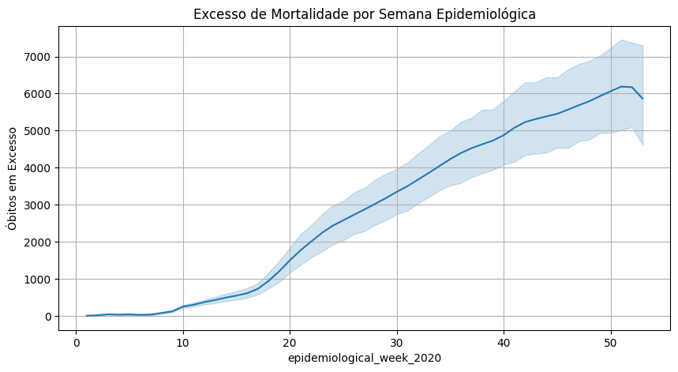

## 🔍 O que foi feito
Foi gerado um gráfico de linha com faixa de variação (intervalo de confiança ou desvio padrão), apresentando o excesso de mortalidade semanal ao longo do ano de 2020. A variável principal representada é:

- `mortes_estados['deaths_total_2020'] - mortes_estados['deaths_total_2019']:` diferença entre o número de óbitos observados e o número de óbitos esperados, estimado a partir de médias históricas para cada semana epidemiológica.

O eixo horizontal representa a semana epidemiológica (1 a 53), enquanto o eixo vertical mostra a quantidade acumulada de óbitos excedentes.

## 📈 Principais Insights
1. **Crescimento Gradual Inicial (Semanas 1–18)**

Até a 18ª semana, os valores de óbitos em excesso permanecem baixos e relativamente estáveis, com pequena variação — indicando que ainda não havia impacto significativo da COVID-19 nos registros de mortalidade.

2. **Aumento Acelerado (Semanas 19–30)**

A partir da 19ª semana, observa-se um crescimento exponencial no excesso de mortes, atingindo cerca de 3.000 óbitos excedentes por volta da 30ª semana. Esse período coincide com o avanço mais agressivo da pandemia no Brasil durante o primeiro semestre de 2020.

3. **Manutenção em Alta (Semanas 30–50)**

Mesmo com alguma desaceleração, os óbitos em excesso continuam crescendo de forma constante, ultrapassando 7.000 mortes excedentes até a 50ª semana. Isso indica um impacto persistente e elevado na mortalidade geral do país.

4. **Faixa de Incerteza Considerável**

A área sombreada em torno da linha principal sugere que há variabilidade nas estimativas semanais, o que pode ser devido a diferenças regionais, atrasos na notificação ou incertezas no modelo de expectativa histórica.

## 🧠 Conclusões Gerais
- O gráfico demonstra com clareza o efeito devastador da pandemia de COVID-19 no Brasil em 2020, com milhares de mortes a mais do que o esperado em condições normais.

- A métrica de excesso de mortalidade é crucial para mensurar o impacto real de crises sanitárias, inclusive considerando mortes indiretas (ex: sobrecarga hospitalar, falta de atendimento, subnotificação).

- A aceleração a partir da 20ª semana é compatível com a explosão dos casos e mortes reportadas oficialmente, confirmando a correlação entre a disseminação do vírus e o aumento expressivo da mortalidade.

- Esta análise é fundamental para reforçar a importância de vigilância epidemiológica robusta, planejamento de resposta a crises e transparência na notificação de dados de saúde pública.

# 📊 Mudança na Mobilidade para Locais de Trabalho no Brasil

## 🔍 O que foi feito

Foi gerado um gráfico de linha temporal com os dados de variação percentual na mobilidade de pessoas em direção aos **locais de trabalho**, com base nos dados do Google Mobility Reports. A métrica representa a mudança percentual em relação à linha de base (período pré-pandêmico).

- **Variável analisada**: `workplaces_percent_change_from_baseline`  
- **Período**: De janeiro de 2020 até o final de 2022  
- **Eixo X**: Datas diárias  
- **Eixo Y**: Variação percentual na mobilidade

## 📈 Principais Insights

1. **Queda Acentuada no Início da Pandemia (março–abril de 2020)**  
   - A mobilidade caiu drasticamente, atingindo **valores abaixo de -60%**, resultado direto do início do isolamento social e do fechamento de escritórios e comércios.

2. **Oscilações e Recuperações Parciais em 2020 e 2021**  
   - A partir do segundo semestre de 2020, há **oscilações semanais**, mas a mobilidade segue abaixo de zero, com **quedas mais intensas em finais de semana e feriados**.
   - Em 2021, nota-se uma **recuperação gradual**, embora ainda com quedas eventuais associadas a novas ondas da pandemia e medidas restritivas.

3. **Recuperação Acelerada a partir de 2022**  
   - A mobilidade volta a valores **próximos ou acima de 0%**, indicando o **retorno progressivo das atividades presenciais**, especialmente após a vacinação em massa.
   - Picos positivos acima de 40% evidenciam **reabertura econômica** e flexibilização das medidas de contenção.

4. **Manutenção de Padrões Semanais**  
   - As variações negativas regulares indicam a **redução da mobilidade em finais de semana**, característica típica dos padrões de comportamento, e que se manteve mesmo após o retorno gradual.

## 🧠 Conclusões Gerais

- A mobilidade para locais de trabalho foi **diretamente impactada pelas medidas de isolamento social**, especialmente no início da pandemia.
- O gráfico mostra como o **comportamento da população foi alterado** ao longo do tempo, com fases de retração e posterior recuperação.
- A partir de 2022, observa-se uma **normalização gradual da mobilidade**, compatível com o avanço da vacinação, diminuição dos casos graves e **reabertura do mercado de trabalho presencial**.
- A análise dessa métrica é essencial para compreender os efeitos sociais e econômicos da pandemia e pode ser usada para **correlação com dados de contágio e produtividade**.

# 📊 Top 10 Estados com Maior Taxa de Letalidade por COVID-19

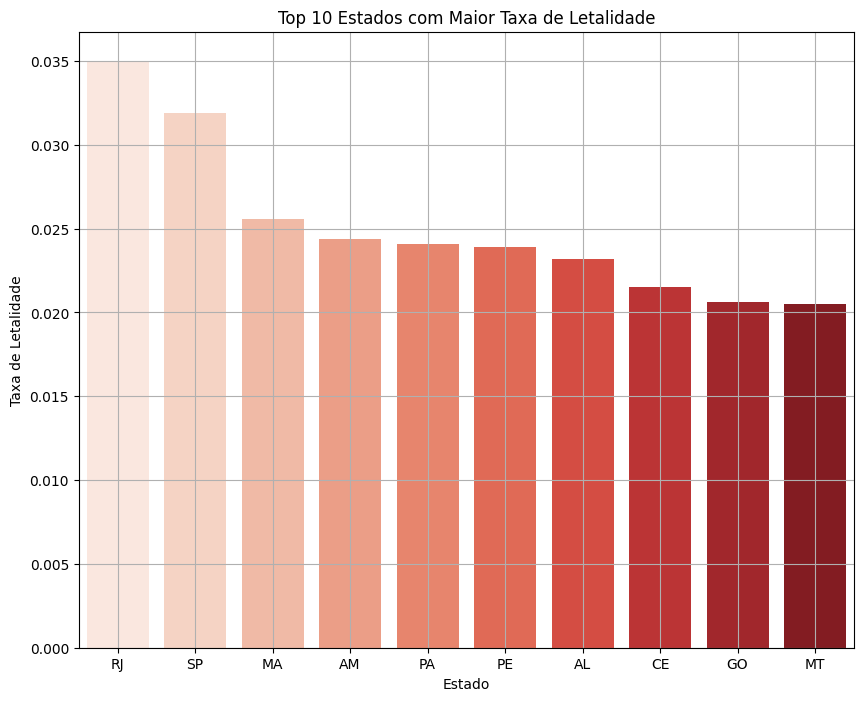

## 🔍 O que foi feito

- Foram utilizados os dados da base `casos_estados`, considerando **apenas a última entrada (mais recente)** de cada estado.
- Entradas agregadas, como `'TOTAL'`, foram removidas, bem como registros com valores nulos de taxa de letalidade.
- A métrica analisada foi:
  - **Taxa de Letalidade (`death_rate`) = mortes acumuladas / casos acumulados**
- O gráfico exibe os 10 estados com os **maiores índices de letalidade** registrados até a data final do conjunto de dados.

## 📈 Principais Insights

1. **Rio de Janeiro (RJ) mantém a liderança isolada**
   - Com uma taxa próxima a **3,5%**, o estado apresenta o maior risco proporcional de morte entre os infectados.

2. **Presença de estados de diferentes regiões**
   - Além do RJ e SP, aparecem estados do **Nordeste (MA, PE, AL, CE)**, **Norte (AM, PA)** e **Centro-Oeste (MT, GO)**, demonstrando a **dispersão nacional da gravidade da pandemia**.

3. **Estados com menor número de casos podem ter taxa inflacionada**
   - Estados com menos testagem ou menor volume de casos tendem a apresentar **letalidade artificialmente elevada**, pois casos leves não são registrados com precisão.

4. **Letalidade alta nem sempre reflete sistema colapsado**
   - Pode estar associada a **subnotificação, dificuldade de acesso ao diagnóstico precoce** ou à **falta de infraestrutura hospitalar em regiões interioranas**.

## 🧠 Conclusões Gerais

- A taxa de letalidade é um importante **indicador da severidade da pandemia**, e sua análise por estado permite **identificar vulnerabilidades regionais**.
- A presença de estados de diferentes regiões no ranking indica que a pandemia **afetou o país de forma desigual e complexa**, exigindo respostas específicas.
- Estados com **alta taxa de letalidade** devem ser objeto de atenção especial em **políticas públicas, reforço em testagem e estrutura hospitalar**.

# 📊 Correlação entre Vacinação e Novas Mortes por COVID-19 no Brasil

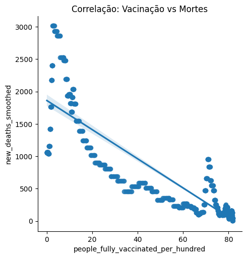

## 🔍 O que foi feito

Foi gerado um **gráfico de dispersão com linha de tendência (regressão linear)** utilizando a biblioteca Seaborn para avaliar a correlação entre:

- **`people_fully_vaccinated_per_hundred`**: percentual da população totalmente vacinada.
- **`new_deaths_smoothed`**: número de novas mortes diárias suavizadas (média móvel de 7 dias).

Os dados foram filtrados com `dropna()` para remover registros com valores ausentes.

## 📈 Principais Insights

1. **Correlação Negativa Clara**
   - O gráfico mostra uma **forte relação inversa**: à medida que a vacinação aumenta, o número de mortes suavizadas tende a diminuir significativamente.

2. **Fase Crítica com Baixa Vacinação**
   - Observa-se que nos pontos onde a vacinação está abaixo de 20%, há **altas taxas de mortalidade** (acima de 2000 mortes por dia).

3. **Estabilização após Cobertura Vacinal Alta**
   - A partir de aproximadamente **60% da população vacinada**, o número de novas mortes atinge patamares muito baixos (próximos a zero), demonstrando **efetividade da vacinação** em massa.

4. **Alinhamento com Evidências Científicas**
   - O padrão observado é compatível com diversos estudos e relatórios internacionais que associam **aumento da cobertura vacinal à queda nas mortes por COVID-19**.

## 🧠 Conclusões Gerais

- A análise evidencia de forma quantitativa a **efetividade da vacinação** na redução da mortalidade por COVID-19 no Brasil.
- A correlação negativa forte entre vacinação e mortes serve como **base para políticas públicas e campanhas de imunização**.
- Gráficos como este ajudam a **reforçar a confiança pública na vacinação**, com base em evidências concretas e dados reais.

# 📊 Casos Mensais de COVID-19 no Brasil

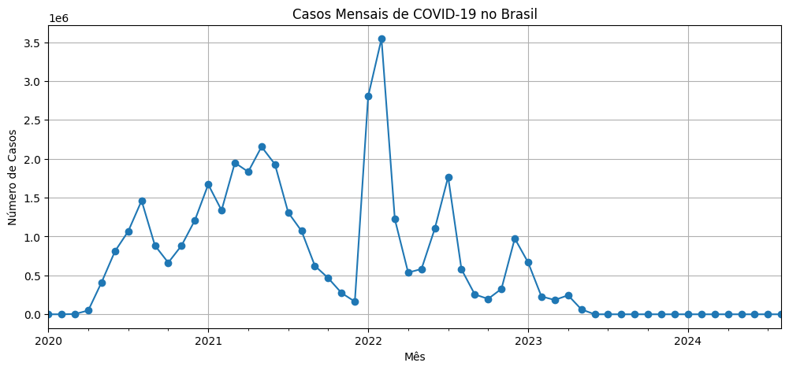

## 🔍 O que foi feito

Foi gerado um gráfico de linha com base na agregação mensal dos casos de COVID-19 no Brasil, utilizando:

- **`brasil['mes_ano'] = brasil['date'].dt.to_period('M')`** para extrair o mês e ano da data.
- Os casos diários foram somados por mês com `groupby('mes_ano')['new_cases'].sum()`.

- **Eixo X**: Meses (de 2020 até início de 2024)  
- **Eixo Y**: Total de novos casos por mês

## 📈 Principais Insights

1. **Crescimento Gradual em 2020 com Múltiplos Picos**  
   - O número de casos aumenta de forma progressiva entre abril e dezembro de 2020, com **picos intermediários** indicando ondas regionais de contágio.

2. **Primeiro Grande Pico em Março de 2021**  
   - O primeiro pico expressivo ocorre em **março de 2021**, com mais de 2 milhões de casos — coincidindo com a **segunda onda da pandemia** no Brasil.

3. **Pico Histórico em Janeiro de 2022**  
   - O maior número mensal de casos foi registrado em **janeiro de 2022**, ultrapassando **3,5 milhões** — este período corresponde à disseminação em massa da **variante Ômicron**, de alta transmissibilidade.

4. **Queda Contínua e Estabilização Pós-Vacinação**  
   - A partir do segundo semestre de 2022, os casos mensais começam a **cair drasticamente** e seguem baixos até 2024, com valores próximos a zero.

## 🧠 Conclusões Gerais

- A evolução mensal dos casos no Brasil reflete **ondas epidêmicas distintas**, marcadas por **novas variantes**, **relaxamento de medidas sanitárias** e **ações de contenção variáveis** entre os estados.
- A **vacinação em massa** teve papel crucial na queda dos casos a partir de 2022, mesmo diante de variantes altamente transmissíveis.
- A análise mensal facilita a visualização de **tendências de longo prazo** e é útil para avaliar o impacto de intervenções políticas e sanitárias em diferentes momentos da pandemia.

# 📊 Top 5 Estados com Mais Casos e Óbitos Acumulados de COVID-19

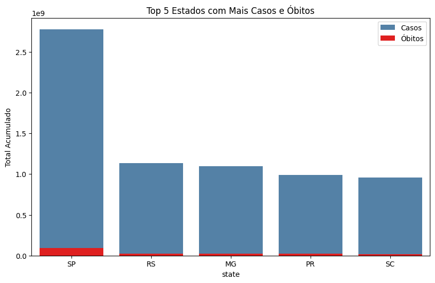

## 🔍 O que foi feito

Foi criado um gráfico de barras sobrepostas para visualizar os **cinco estados brasileiros com maior número de casos confirmados de COVID-19**, juntamente com o número absoluto de óbitos acumulados. Os dados foram agregados com:

- `casos_estados.groupby('state')[['confirmed', 'deaths']].sum()`

- **Eixo X**: Siglas dos estados  
- **Eixo Y**: Número acumulado de casos e óbitos  
- As barras azuis representam os **casos confirmados**, enquanto as barras vermelhas mostram os **óbitos** sobrepostos aos casos.

## 📈 Principais Insights

1. **São Paulo lidera com ampla margem**  
   - O estado de **SP** apresenta disparadamente o maior número de casos confirmados e óbitos, refletindo sua grande população e densidade urbana elevada.

2. **Outros estados do Sul e Sudeste também se destacam**  
   - **RS**, **MG**, **PR** e **SC** aparecem na sequência, todos com elevados números absolutos de casos e mortes, possivelmente associados a melhor capacidade de testagem e registro.

3. **Desproporção entre Casos e Óbitos é visível**  
   - A diferença de escala entre as barras (óbitos em vermelho sendo visualmente pequenas) demonstra que a **letalidade relativa é baixa**, apesar dos números absolutos de óbitos serem elevados.

4. **SP concentra grande parte do impacto nacional**  
   - A magnitude dos dados em São Paulo reforça a necessidade de **ações específicas de contenção e mitigação em centros urbanos altamente populosos**.

## 🧠 Conclusões Gerais

- O gráfico evidencia que **os estados mais populosos e economicamente ativos** concentram a maior parte dos casos e mortes da pandemia.
- É essencial considerar tanto os números absolutos quanto os **indicadores relativos (como taxa de letalidade)** para avaliar corretamente o impacto regional.
- Essas análises auxiliam na priorização de recursos e no planejamento de **respostas sanitárias proporcionais à magnitude do problema**.

# 📊 Boxplot de Casos Novos por Mês no Brasil

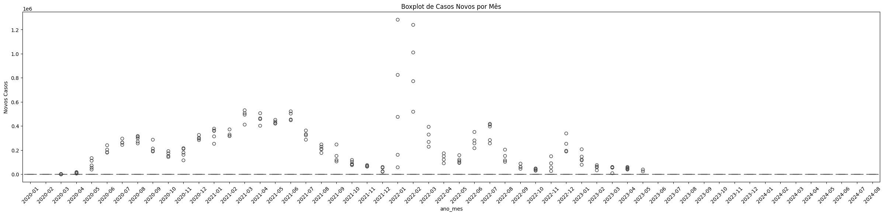

## 🔍 O que foi feito

Foi criado um **gráfico de boxplot** para analisar a distribuição mensal dos **casos novos de COVID-19** no Brasil ao longo do tempo. Para isso:

- Foi extraído o mês e ano da coluna de data com `brasil['ano_mes'] = brasil['date'].dt.to_period('M')`.
- Foram removidas as entradas nulas da coluna `new_cases`.
- Utilizou-se o `sns.boxplot` para representar a **variação e a presença de outliers** em cada mês.

- **Eixo X**: Meses (formato ano-mês)
- **Eixo Y**: Número de novos casos diários por mês

## 📈 Principais Insights

1. **Alta variação entre meses críticos da pandemia**  
   - Períodos como **março/abril de 2021** e **janeiro de 2022** apresentam **maior dispersão**, com vários outliers e ampla faixa interquartil, indicando picos e instabilidade nos registros diários.

2. **Outliers indicam dias com picos extremos de casos**  
   - Muitos pontos fora das caixas superiores representam **explosões pontuais** de contágio, especialmente durante a disseminação de novas variantes.

3. **Redução de casos e dispersão a partir de 2023**  
   - A partir de meados de 2022 e especialmente em 2023, observa-se **redução significativa tanto da mediana quanto da variabilidade** — evidência da estabilização do cenário pandêmico.

4. **Padrões sazonais e oscilações mensais**  
   - O gráfico mostra que os casos não foram uniformes ao longo do tempo, sendo afetados por **sazonalidade, medidas restritivas, vacinação e novas variantes**.

## 🧠 Conclusões Gerais

- O boxplot é uma excelente ferramenta para **visualizar a variabilidade** dos dados ao longo do tempo, especialmente em situações de alta flutuação como a pandemia de COVID-19.
- A análise destaca **momentos críticos da pandemia**, permitindo a identificação de **meses com maiores instabilidades e surtos**.
- A estabilização dos casos a partir de 2023 reforça os efeitos positivos das **ações de saúde pública e imunização em massa**.

# 📊 Média Móvel de Casos e Mortes (7 dias) no Brasil

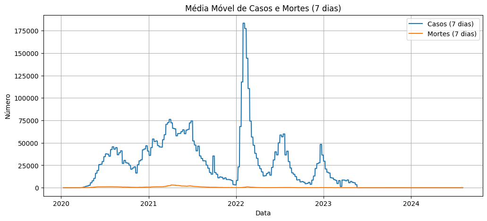

## 🔍 O que foi feito

Foi criado um gráfico de linha com a **média móvel de 7 dias** para suavizar as flutuações diárias nos dados de:

- **`new_cases`** → armazenado em `media_movel_casos`
- **`new_deaths`** → armazenado em `media_movel_mortes`

A média móvel é uma técnica estatística usada para **suavizar ruídos** e destacar tendências consistentes nos dados ao longo do tempo.

- **Eixo X**: Datas (2020 a 2024)  
- **Eixo Y**: Número de casos e mortes por dia (média dos 7 dias anteriores)

## 📈 Principais Insights

1. **Visualização mais clara das tendências pandêmicas**
   - A suavização por média móvel reduz o ruído diário e permite **identificar com precisão os períodos de alta transmissão** e mortalidade.

2. **Três grandes ondas de infecção**
   - O gráfico revela claramente três picos principais:
     - **Início de 2021** (associado à variante Gama)
     - **Início de 2022** (maior pico de casos, com a variante Ômicron)
     - **Ondas menores ao longo de 2022–2023**, com menor impacto em mortes.

3. **Descolamento entre picos de casos e mortes**
   - Nota-se uma **defasagem entre os picos**: o aumento nos casos é seguido por um aumento nas mortes com atraso de algumas semanas — comportamento típico de doenças infecciosas.

4. **Redução acentuada a partir de 2023**
   - Após o segundo semestre de 2022, as curvas de casos e mortes **caem significativamente**, mantendo-se próximas de zero até 2024 — indicando controle da pandemia.

## 🧠 Conclusões Gerais

- A utilização da média móvel de 7 dias é essencial para **interpretar corretamente os dados epidemiológicos**, eliminando distorções de fim de semana e feriados.
- O gráfico demonstra o **impacto direto das variantes** e da **vacinação em massa**, refletido na queda de mortes mesmo em momentos de alta transmissão.
- A análise reforça a importância de **respostas rápidas nas primeiras semanas de aumento dos casos**, dado o intervalo observado até o crescimento das mortes.

# 📊 Mapa de Calor: Evolução Semanal de Óbitos por COVID-19 por Estado (2020)

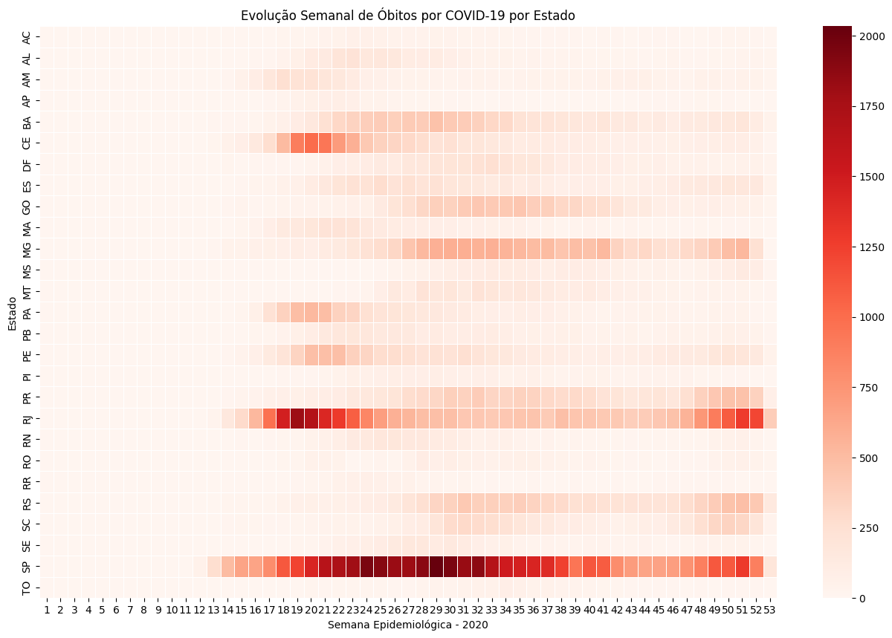

## 🔍 O que foi feito

Foi construído um **heatmap (mapa de calor)** com os dados de óbitos por COVID-19 em cada estado brasileiro ao longo das **semanas epidemiológicas de 2020**, utilizando:

- `pivot_table()` para transformar os dados no formato de matriz:
  - **Index**: `state` (sigla do estado)
  - **Colunas**: `epidemiological_week_2020` (1 a 53)
  - **Valores**: `new_deaths_covid19` (soma semanal por estado)

- A paleta de cores `Reds` foi utilizada para representar o volume de mortes:
  - Tons mais claros = menor número de óbitos
  - Tons mais escuros = maior número de óbitos

## 📈 Principais Insights

1. **SP e RJ concentram os maiores picos**
   - Os estados de **São Paulo** e **Rio de Janeiro** apresentam os quadrantes mais escuros, indicando os **maiores números absolutos de óbitos semanais** durante boa parte do ano.

2. **Início da mortalidade crítica entre semanas 17 e 23**
   - A maioria dos estados começou a registrar **aumento significativo de óbitos entre as semanas 17 e 23**, alinhado ao avanço nacional da primeira onda da pandemia.

3. **Desigualdade regional no impacto**
   - Regiões como Norte e Nordeste (ex: AM, CE, PE) também mostram **períodos intensos**, porém com padrões distintos de duração e intensidade comparados ao Sudeste.

4. **Duração prolongada da crise em grandes centros**
   - Estados mais populosos apresentam **períodos mais longos com intensidade alta**, indicando **maior pressão sobre o sistema de saúde**.

## 🧠 Conclusões Gerais

- O heatmap permite uma **visualização comparativa e temporal clara** dos impactos da pandemia por estado.
- A análise reforça que **a disseminação e a letalidade da COVID-19 não foram uniformes** no território brasileiro.
- Ferramentas como essa auxiliam na **identificação de padrões sazonais**, surtos localizados e **demandas específicas por região**, sendo úteis para o planejamento de **respostas sanitárias regionais**.

# 📊 Ocupação Total Média de Leitos Hospitalares por COVID-19 no Tempo

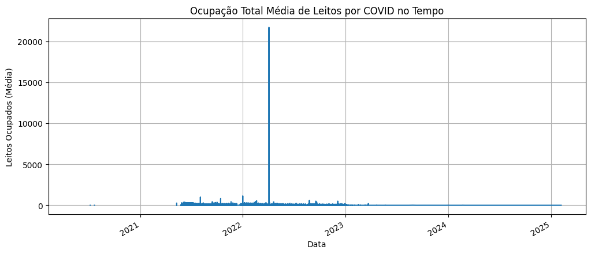

## 🔍 O que foi feito

Foi criado um gráfico de linha com a **ocupação hospitalar total por COVID-19**, somando os leitos de:

- **UTI (`ocupacaoCovidUti`)**
- **Clínicos (`ocupacaoCovidCli`)**

A soma foi agrupada por data (`_created_at`) e a média diária foi calculada:

- `ocupacao_total = ocupacaoCovidUti + ocupacaoCovidCli`
- Agrupamento com `.groupby('_created_at').mean()`

- **Eixo X**: Datas (2021 a 2025)  
- **Eixo Y**: Média diária de leitos ocupados por COVID-19 (total)

## 📈 Principais Insights

1. **Período crítico entre 2021 e meados de 2022**  
   - O gráfico mostra **ocupação hospitalar significativa** nesse período, refletindo as principais ondas da pandemia e o estresse sobre o sistema de saúde.

2. **Pico anômalo em 2022**  
   - Há um **valor extremamente elevado e isolado** que ultrapassa 20.000 leitos — este ponto provavelmente é um **outlier**, sugerindo erro de entrada ou consolidação de dados acumulados.

3. **Redução e estabilização após 2022**  
   - A partir de meados de 2022, a ocupação média de leitos cai de forma acentuada, mantendo-se **próxima de zero até 2025**, alinhado à contenção da pandemia.

4. **Importância da média para suavizar variações diárias**  
   - O uso da média permite reduzir flutuações e visualizar a **tendência geral da ocupação**, destacando momentos de maior pressão hospitalar.

## 🧠 Conclusões Gerais

- A evolução da ocupação de leitos hospitalares reflete de forma clara os **momentos mais críticos da pandemia**, sendo um indicador essencial para a gestão da capacidade hospitalar.
- O pico anormal identificado deve ser **revisto ou tratado como outlier** para não comprometer a análise.
- A redução sustentada da ocupação após 2022 evidencia o **impacto da vacinação, protocolos clínicos e fim das grandes ondas epidêmicas**.

