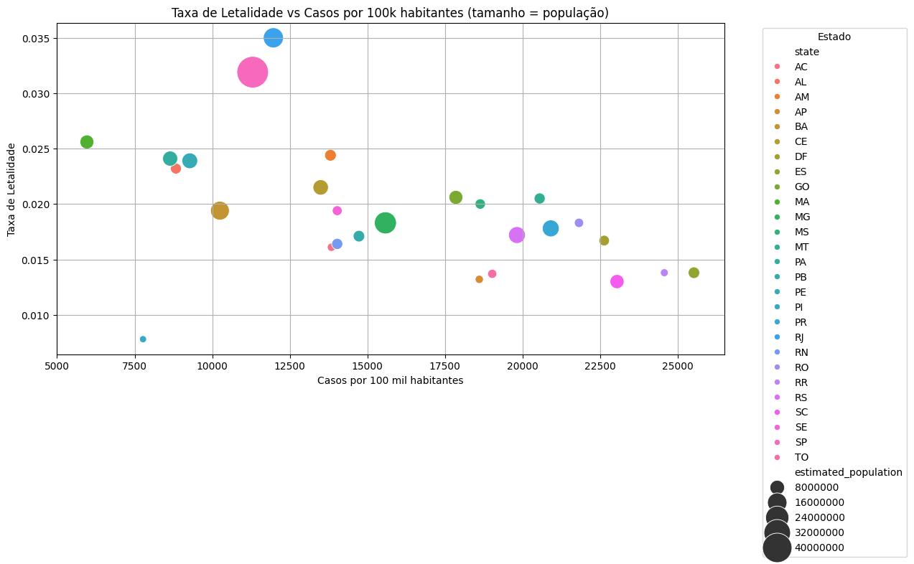
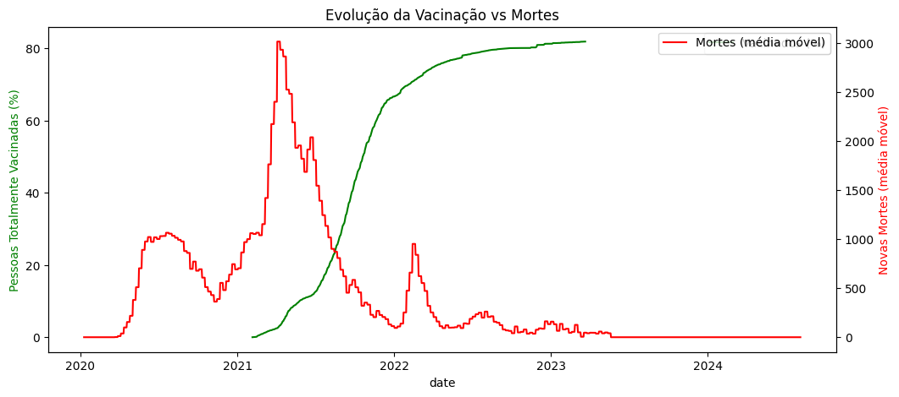
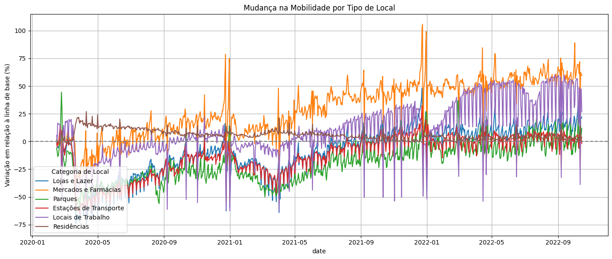

# 📊 Análise Detalhada - Covid19 no Brasil

Este documento apresenta uma visão aprofundada das análises realizadas por dimensão nos Datasets relacionado a Covid19 no Brasil.

# 📊 Evolução de Casos e Mortes por COVID-19 no Brasil

## 🔍 O que foi feito

Foi criado um gráfico de linha com as séries temporais suavizadas por **média móvel de 7 dias**, a fim de reduzir ruídos diários e destacar tendências mais confiáveis ao longo do tempo.

As variáveis utilizadas foram:

- `new_cases_smoothed`: novos casos diários suavizados
- `new_deaths_smoothed`: novas mortes diárias suavizadas

O gráfico cobre o período de 2020 até 2024.

## 📈 Principais Insights

1. **Múltiplas ondas da pandemia**
   - É possível observar **três grandes picos de infecção**, cada um com características distintas:
     - A primeira onda, entre maio e agosto de 2020, com crescimento progressivo.
     - A segunda, mais severa, entre março e junho de 2021 — associada à variante Gama.
     - A terceira, com o maior volume de casos no início de 2022 — ligada à variante Ômicron.

2. **Defasagem entre casos e mortes**
   - Nota-se um **atraso de algumas semanas entre os picos de casos e os de mortes**, refletindo o tempo de progressão da doença até os desfechos fatais.

3. **Redução sustentada após vacinação**
   - A partir de meados de 2022, há uma queda acentuada nas curvas, especialmente nas mortes, indicando **efetividade da vacinação e melhor preparo hospitalar**.

4. **Estabilização em 2023**
   - As curvas mantêm níveis baixos ao longo de 2023 e 2024, indicando **controle pandêmico duradouro**.

## 🧠 Conclusões Gerais

- A análise temporal permite identificar claramente **os momentos mais críticos da pandemia no Brasil**.
- A defasagem entre casos e mortes reforça a importância de **ações precoces** diante de novos surtos.
- A queda progressiva das mortes, mesmo com novos picos de casos em 2022, destaca o **impacto positivo da vacinação em larga escala**.
- O gráfico serve como base sólida para decisões em saúde pública, estudos comparativos e avaliação de políticas sanitárias ao longo do tempo.

# 📊 Pessoas Totalmente Vacinadas por 100 Habitantes no Brasil

## 🔍 O que foi feito

Foi criado um gráfico de linha para acompanhar a evolução da **proporção da população brasileira com esquema vacinal completo** contra a COVID-19 ao longo do tempo.

A métrica utilizada foi:

- `people_fully_vaccinated_per_hundred`: número de pessoas totalmente vacinadas **a cada 100 habitantes**.

O gráfico cobre o período de início da vacinação em 2021 até o fim das atualizações em 2023.

## 📈 Principais Insights

1. **Início gradual da vacinação (1º semestre de 2021)**
   - O avanço inicial foi lento, refletindo dificuldades logísticas e de disponibilidade de vacinas no início da campanha.

2. **Aceleração significativa entre julho e novembro de 2021**
   - Nesse período, observa-se uma **curva acentuada de crescimento**, indicando ampla adesão e ampliação do acesso aos imunizantes.

3. **Estabilização da cobertura vacinal a partir de 2022**
   - O percentual de totalmente vacinados ultrapassa **80% da população** e estabiliza-se, refletindo o esgotamento do público-alvo e resistência vacinal residual.

4. **Queda na atualização dos dados a partir de 2023**
   - A curva se mantém estática, indicando o **encerramento ou desaceleração da coleta de dados** de vacinação pública.

## 🧠 Conclusões Gerais

- A vacinação contra a COVID-19 no Brasil atingiu **níveis elevados de cobertura**, sendo um dos principais fatores na redução dos óbitos observada em anos seguintes.
- O gráfico confirma o **êxito da campanha nacional**, embora ressalte a importância de **manter campanhas de reforço** e combate à desinformação.
- Esta visualização é essencial para contextualizar outras análises (como mortalidade e mobilidade) e reforça o **papel central da vacinação** no controle da pandemia.

# 📊 Vacinação vs Mortes por COVID-19 no Brasil

## 🔍 O que foi feito

Foi gerado um gráfico de linha para comparar, ao longo do tempo:

- A proporção da população **vacinada com pelo menos uma dose** (`people_vaccinated_per_hundred`)
- O número de **novas mortes diárias**, suavizado por média móvel de 7 dias (`new_deaths_smoothed`)

Ambas as séries foram traçadas no mesmo eixo para **visualizar a relação temporal entre o avanço da vacinação e a redução de óbitos**.

## 📈 Principais Insights

1. **Picos de mortalidade ocorreram antes do avanço vacinal**
   - Em especial durante o 1º semestre de 2021, quando a vacinação ainda era incipiente, o Brasil enfrentou seu **maior pico de óbitos diários**.

2. **Início da vacinação coincidiu com queda nas mortes**
   - A partir do segundo semestre de 2021, a curva de vacinação cresce e, **em paralelo, a curva de mortes entra em queda acentuada**.

3. **Redução sustentada de óbitos com aumento da cobertura vacinal**
   - Em 2022, à medida que o percentual de vacinados supera os 60%, as mortes se mantêm em **níveis significativamente mais baixos**, mesmo durante novas ondas de infecção.

4. **Estabilização em 2023**
   - A curva de vacinação se estabiliza, e a mortalidade permanece próxima de zero — indicando um **efeito duradouro da imunização em massa**.

## 🧠 Conclusões Gerais

- O gráfico evidencia a **correlação inversa entre vacinação e mortalidade**, com quedas consistentes de óbitos à medida que a população vacinada aumentava.
- Serve como **base visual forte para políticas públicas de vacinação** e campanhas de conscientização.
- A análise reforça a **efetividade da vacina como instrumento de mitigação da pandemia**, mesmo diante de novas variantes e ondas posteriores.

# 📊 Ocupação Média de Leitos de UTI por COVID-19 no Brasil

## 🔍 O que foi feito

Foi construído um gráfico de linha com base na série temporal da variável:

- `ocupacaoCovidUti`: número de leitos de **Unidade de Terapia Intensiva (UTI)** ocupados por pacientes com COVID-19.

Os dados foram agrupados por data (`_created_at`) e a **média diária nacional** foi calculada. A série abrange o período de 2021 a 2025.

## 📈 Principais Insights

1. **Aumento abrupto na ocupação de UTIs entre 2021 e início de 2022**
   - Observa-se um crescimento acentuado da média de ocupação durante os picos pandêmicos, **atingindo valores críticos de sobrecarga hospitalar**.

2. **Dois grandes picos anômalos**
   - Há **valores atípicos (outliers)** que ultrapassam a média esperada (>1000), possivelmente causados por:
     - Erros de digitação nos registros.
     - Consolidação de dados acumulados em dias únicos.
   - Esses picos devem ser tratados ou filtrados para análises mais precisas.

3. **Redução progressiva da ocupação em 2022**
   - A queda coincide com o avanço da vacinação e menor incidência de casos graves, demonstrando **descompressão no sistema de saúde**.

4. **Estabilização próxima a zero em 2023–2025**
   - Após os picos críticos, a ocupação média de UTIs cai para patamares mínimos, indicando **controle efetivo da pandemia**.

## 🧠 Conclusões Gerais

- O gráfico revela de forma clara os momentos de **maior pressão sobre os hospitais**, refletindo a gravidade dos surtos da COVID-19.
- A redução consistente da ocupação de UTIs acompanha o avanço da vacinação e melhora do manejo clínico.
- A análise reforça a importância de **monitorar a capacidade hospitalar** durante pandemias e crises sanitárias, permitindo antecipação de colapsos.

# 📊 Excesso de Mortalidade por Semana Epidemiológica no Brasil (2020)

## 🔍 O que foi feito

Foi gerado um gráfico de linha com base na variável:

- `excesso = deaths_total_2020 - deaths_total_2019`: diferença entre os óbitos totais de 2020 e o total de 2019, **por semana epidemiológica**.

Essa métrica permite estimar o **excesso de mortalidade**, isto é, o número de mortes acima do esperado para o mesmo período em anos anteriores.

A análise cobre todas as semanas epidemiológicas do ano de 2020 (semanas 1 a 53).

## 📈 Principais Insights

1. **Estabilidade nas primeiras semanas**
   - Até a 18ª semana, o excesso de mortalidade é mínimo, indicando **padrão compatível com anos anteriores**.

2. **Aumento abrupto a partir da 19ª semana**
   - Coincide com o **início da disseminação acelerada da COVID-19 no Brasil**, refletindo o impacto direto da pandemia sobre a mortalidade.

3. **Crescimento contínuo até o final do ano**
   - A linha segue uma **tendência ascendente** persistente, com o excesso ultrapassando **7.000 óbitos** em relação a 2019, ao final da 52ª semana.

4. **Faixa de incerteza nas estimativas**
   - A área sombreada representa o desvio entre regiões ou estados, indicando **variação territorial ou imprecisão nos registros de mortalidade**.

## 🧠 Conclusões Gerais

- O gráfico demonstra com clareza o **impacto extraordinário da pandemia sobre a mortalidade**, indo além dos óbitos oficialmente atribuídos à COVID-19.
- A métrica de **excesso de mortalidade** é essencial para capturar:
  - **Subnotificação** de mortes por COVID-19.
  - **Mortes indiretas** causadas por colapso do sistema de saúde ou agravamento de outras condições sem atendimento.
- Essa abordagem é amplamente utilizada em **epidemiologia, saúde pública e auditorias de impacto em crises sanitárias.**

# 📊 Mudança na Mobilidade para Locais de Trabalho no Brasil

## 🔍 O que foi feito

Foi criado um gráfico de linha com base na métrica:

- `workplaces_percent_change_from_baseline`: variação percentual na mobilidade em **locais de trabalho**, comparada à linha de base (pré-pandemia), de acordo com os dados do Google Community Mobility Reports.

A série cobre o período de 2020 até o segundo semestre de 2022.

## 📈 Principais Insights

1. **Queda acentuada no início da pandemia (março de 2020)**
   - Observa-se uma **redução superior a -50%**, refletindo o impacto das medidas de isolamento e o crescimento do trabalho remoto no início da crise sanitária.

2. **Recuperação gradual com forte oscilação**
   - A partir de meados de 2020, há uma retomada progressiva da mobilidade, ainda que com **oscilações semanais intensas**, associadas a:
     - Fins de semana (mobilidade reduzida)
     - Feriados prolongados
     - Reforço ou afrouxamento de medidas locais

3. **Aumento sustentado em 2022**
   - A mobilidade volta a patamares **acima de 40% positivos**, indicando uma **retomada consistente do trabalho presencial** nas principais regiões.

4. **Presença de picos negativos recorrentes**
   - As quedas pontuais continuam, evidenciando que, mesmo com a recuperação, há **momentos de retração temporária** no fluxo de trabalhadores.

## 🧠 Conclusões Gerais

- A análise revela os efeitos diretos da pandemia na **dinâmica do trabalho presencial**, especialmente com a adoção de **home office em larga escala** no Brasil.
- A mobilidade para locais de trabalho pode servir como **proxy para avaliar retomada econômica**, aderência a medidas de isolamento e mudanças estruturais no mercado de trabalho.
- O padrão oscilante reforça a importância de combinar essas análises com indicadores de saúde pública e políticas regionais.

# 📊 Top 10 Estados com Maior Taxa de Letalidade por COVID-19

## 🔍 O que foi feito

- Foram utilizados os dados da base `casos_estados`, considerando **apenas a última entrada (mais recente)** de cada estado.
- Entradas agregadas, como `'TOTAL'`, foram removidas, bem como registros com valores nulos de taxa de letalidade.
- A métrica analisada foi:
  - **Taxa de Letalidade (`death_rate`) = mortes acumuladas / casos acumulados**
- O gráfico exibe os 10 estados com os **maiores índices de letalidade** registrados até a data final do conjunto de dados.

## 📈 Principais Insights

1. **Rio de Janeiro (RJ) mantém a liderança isolada**
   - Com uma taxa próxima a **3,5%**, o estado apresenta o maior risco proporcional de morte entre os infectados.

2. **Presença de estados de diferentes regiões**
   - Além do RJ e SP, aparecem estados do **Nordeste (MA, PE, AL, CE)**, **Norte (AM, PA)** e **Centro-Oeste (MT, GO)**, demonstrando a **dispersão nacional da gravidade da pandemia**.

3. **Estados com menor número de casos podem ter taxa inflacionada**
   - Estados com menos testagem ou menor volume de casos tendem a apresentar **letalidade artificialmente elevada**, pois casos leves não são registrados com precisão.

4. **Letalidade alta nem sempre reflete sistema colapsado**
   - Pode estar associada a **subnotificação, dificuldade de acesso ao diagnóstico precoce** ou à **falta de infraestrutura hospitalar em regiões interioranas**.

## 🧠 Conclusões Gerais

- A taxa de letalidade é um importante **indicador da severidade da pandemia**, e sua análise por estado permite **identificar vulnerabilidades regionais**.
- A presença de estados de diferentes regiões no ranking indica que a pandemia **afetou o país de forma desigual e complexa**, exigindo respostas específicas.
- Estados com **alta taxa de letalidade** devem ser objeto de atenção especial em **políticas públicas, reforço em testagem e estrutura hospitalar**.

# 📊 Correlação entre Vacinação e Novas Mortes por COVID-19 no Brasil

## 🔍 O que foi feito

Foi gerado um **gráfico de dispersão com linha de tendência (regressão linear)** utilizando a biblioteca Seaborn para avaliar a correlação entre:

- **`people_fully_vaccinated_per_hundred`**: percentual da população totalmente vacinada.
- **`new_deaths_smoothed`**: número de novas mortes diárias suavizadas (média móvel de 7 dias).

Os dados foram filtrados com `dropna()` para remover registros com valores ausentes.

## 📈 Principais Insights

1. **Correlação Negativa Clara**
   - O gráfico mostra uma **forte relação inversa**: à medida que a vacinação aumenta, o número de mortes suavizadas tende a diminuir significativamente.

2. **Fase Crítica com Baixa Vacinação**
   - Observa-se que nos pontos onde a vacinação está abaixo de 20%, há **altas taxas de mortalidade** (acima de 2000 mortes por dia).

3. **Estabilização após Cobertura Vacinal Alta**
   - A partir de aproximadamente **60% da população vacinada**, o número de novas mortes atinge patamares muito baixos (próximos a zero), demonstrando **efetividade da vacinação** em massa.

4. **Alinhamento com Evidências Científicas**
   - O padrão observado é compatível com diversos estudos e relatórios internacionais que associam **aumento da cobertura vacinal à queda nas mortes por COVID-19**.

## 🧠 Conclusões Gerais

- A análise evidencia de forma quantitativa a **efetividade da vacinação** na redução da mortalidade por COVID-19 no Brasil.
- A correlação negativa forte entre vacinação e mortes serve como **base para políticas públicas e campanhas de imunização**.
- Gráficos como este ajudam a **reforçar a confiança pública na vacinação**, com base em evidências concretas e dados reais.

# 📊 Casos Mensais de COVID-19 no Brasil

## 🔍 O que foi feito

Foi gerado um gráfico de linha com base na agregação mensal dos casos de COVID-19 no Brasil, utilizando:

- **`brasil['mes_ano'] = brasil['date'].dt.to_period('M')`** para extrair o mês e ano da data.
- Os casos diários foram somados por mês com `groupby('mes_ano')['new_cases'].sum()`.

- **Eixo X**: Meses (de 2020 até início de 2024)  
- **Eixo Y**: Total de novos casos por mês

## 📈 Principais Insights

1. **Crescimento Gradual em 2020 com Múltiplos Picos**  
   - O número de casos aumenta de forma progressiva entre abril e dezembro de 2020, com **picos intermediários** indicando ondas regionais de contágio.

2. **Primeiro Grande Pico em Março de 2021**  
   - O primeiro pico expressivo ocorre em **março de 2021**, com mais de 2 milhões de casos — coincidindo com a **segunda onda da pandemia** no Brasil.

3. **Pico Histórico em Janeiro de 2022**  
   - O maior número mensal de casos foi registrado em **janeiro de 2022**, ultrapassando **3,5 milhões** — este período corresponde à disseminação em massa da **variante Ômicron**, de alta transmissibilidade.

4. **Queda Contínua e Estabilização Pós-Vacinação**  
   - A partir do segundo semestre de 2022, os casos mensais começam a **cair drasticamente** e seguem baixos até 2024, com valores próximos a zero.

## 🧠 Conclusões Gerais

- A evolução mensal dos casos no Brasil reflete **ondas epidêmicas distintas**, marcadas por **novas variantes**, **relaxamento de medidas sanitárias** e **ações de contenção variáveis** entre os estados.
- A **vacinação em massa** teve papel crucial na queda dos casos a partir de 2022, mesmo diante de variantes altamente transmissíveis.
- A análise mensal facilita a visualização de **tendências de longo prazo** e é útil para avaliar o impacto de intervenções políticas e sanitárias em diferentes momentos da pandemia.

# 📊 Top 5 Estados com Mais Casos e Óbitos Acumulados de COVID-19

## 🔍 O que foi feito

Foi criado um gráfico de barras sobrepostas para visualizar os **cinco estados brasileiros com maior número de casos confirmados de COVID-19**, juntamente com o número absoluto de óbitos acumulados. Os dados foram agregados com:

- `casos_estados.groupby('state')[['confirmed', 'deaths']].sum()`

- **Eixo X**: Siglas dos estados  
- **Eixo Y**: Número acumulado de casos e óbitos  
- As barras azuis representam os **casos confirmados**, enquanto as barras vermelhas mostram os **óbitos** sobrepostos aos casos.

## 📈 Principais Insights

1. **São Paulo lidera com ampla margem**  
   - O estado de **SP** apresenta disparadamente o maior número de casos confirmados e óbitos, refletindo sua grande população e densidade urbana elevada.

2. **Outros estados do Sul e Sudeste também se destacam**  
   - **RS**, **MG**, **PR** e **SC** aparecem na sequência, todos com elevados números absolutos de casos e mortes, possivelmente associados a melhor capacidade de testagem e registro.

3. **Desproporção entre Casos e Óbitos é visível**  
   - A diferença de escala entre as barras (óbitos em vermelho sendo visualmente pequenas) demonstra que a **letalidade relativa é baixa**, apesar dos números absolutos de óbitos serem elevados.

4. **SP concentra grande parte do impacto nacional**  
   - A magnitude dos dados em São Paulo reforça a necessidade de **ações específicas de contenção e mitigação em centros urbanos altamente populosos**.

## 🧠 Conclusões Gerais

- O gráfico evidencia que **os estados mais populosos e economicamente ativos** concentram a maior parte dos casos e mortes da pandemia.
- É essencial considerar tanto os números absolutos quanto os **indicadores relativos (como taxa de letalidade)** para avaliar corretamente o impacto regional.
- Essas análises auxiliam na priorização de recursos e no planejamento de **respostas sanitárias proporcionais à magnitude do problema**.

# 📊 Boxplot de Casos Novos por Mês no Brasil

## 🔍 O que foi feito

Foi criado um **gráfico de boxplot** para analisar a distribuição mensal dos **casos novos de COVID-19** no Brasil ao longo do tempo. Para isso:

- Foi extraído o mês e ano da coluna de data com `brasil['ano_mes'] = brasil['date'].dt.to_period('M')`.
- Foram removidas as entradas nulas da coluna `new_cases`.
- Utilizou-se o `sns.boxplot` para representar a **variação e a presença de outliers** em cada mês.

- **Eixo X**: Meses (formato ano-mês)
- **Eixo Y**: Número de novos casos diários por mês

## 📈 Principais Insights

1. **Alta variação entre meses críticos da pandemia**  
   - Períodos como **março/abril de 2021** e **janeiro de 2022** apresentam **maior dispersão**, com vários outliers e ampla faixa interquartil, indicando picos e instabilidade nos registros diários.

2. **Outliers indicam dias com picos extremos de casos**  
   - Muitos pontos fora das caixas superiores representam **explosões pontuais** de contágio, especialmente durante a disseminação de novas variantes.

3. **Redução de casos e dispersão a partir de 2023**  
   - A partir de meados de 2022 e especialmente em 2023, observa-se **redução significativa tanto da mediana quanto da variabilidade** — evidência da estabilização do cenário pandêmico.

4. **Padrões sazonais e oscilações mensais**  
   - O gráfico mostra que os casos não foram uniformes ao longo do tempo, sendo afetados por **sazonalidade, medidas restritivas, vacinação e novas variantes**.

## 🧠 Conclusões Gerais

- O boxplot é uma excelente ferramenta para **visualizar a variabilidade** dos dados ao longo do tempo, especialmente em situações de alta flutuação como a pandemia de COVID-19.
- A análise destaca **momentos críticos da pandemia**, permitindo a identificação de **meses com maiores instabilidades e surtos**.
- A estabilização dos casos a partir de 2023 reforça os efeitos positivos das **ações de saúde pública e imunização em massa**.

# 📊 Média Móvel de Casos e Mortes (7 dias) no Brasil

## 🔍 O que foi feito

Foi criado um gráfico de linha com a **média móvel de 7 dias** para suavizar as flutuações diárias nos dados de:

- **`new_cases`** → armazenado em `media_movel_casos`
- **`new_deaths`** → armazenado em `media_movel_mortes`

A média móvel é uma técnica estatística usada para **suavizar ruídos** e destacar tendências consistentes nos dados ao longo do tempo.

- **Eixo X**: Datas (2020 a 2024)  
- **Eixo Y**: Número de casos e mortes por dia (média dos 7 dias anteriores)

## 📈 Principais Insights

1. **Visualização mais clara das tendências pandêmicas**
   - A suavização por média móvel reduz o ruído diário e permite **identificar com precisão os períodos de alta transmissão** e mortalidade.

2. **Três grandes ondas de infecção**
   - O gráfico revela claramente três picos principais:
     - **Início de 2021** (associado à variante Gama)
     - **Início de 2022** (maior pico de casos, com a variante Ômicron)
     - **Ondas menores ao longo de 2022–2023**, com menor impacto em mortes.

3. **Descolamento entre picos de casos e mortes**
   - Nota-se uma **defasagem entre os picos**: o aumento nos casos é seguido por um aumento nas mortes com atraso de algumas semanas — comportamento típico de doenças infecciosas.

4. **Redução acentuada a partir de 2023**
   - Após o segundo semestre de 2022, as curvas de casos e mortes **caem significativamente**, mantendo-se próximas de zero até 2024 — indicando controle da pandemia.

## 🧠 Conclusões Gerais

- A utilização da média móvel de 7 dias é essencial para **interpretar corretamente os dados epidemiológicos**, eliminando distorções de fim de semana e feriados.
- O gráfico demonstra o **impacto direto das variantes** e da **vacinação em massa**, refletido na queda de mortes mesmo em momentos de alta transmissão.
- A análise reforça a importância de **respostas rápidas nas primeiras semanas de aumento dos casos**, dado o intervalo observado até o crescimento das mortes.

# 📊 Mapa de Calor: Evolução Semanal de Óbitos por COVID-19 por Estado (2020)

## 🔍 O que foi feito

Foi construído um **heatmap (mapa de calor)** com os dados de óbitos por COVID-19 em cada estado brasileiro ao longo das **semanas epidemiológicas de 2020**, utilizando:

- `pivot_table()` para transformar os dados no formato de matriz:
  - **Index**: `state` (sigla do estado)
  - **Colunas**: `epidemiological_week_2020` (1 a 53)
  - **Valores**: `new_deaths_covid19` (soma semanal por estado)

- A paleta de cores `Reds` foi utilizada para representar o volume de mortes:
  - Tons mais claros = menor número de óbitos
  - Tons mais escuros = maior número de óbitos

## 📈 Principais Insights

1. **SP e RJ concentram os maiores picos**
   - Os estados de **São Paulo** e **Rio de Janeiro** apresentam os quadrantes mais escuros, indicando os **maiores números absolutos de óbitos semanais** durante boa parte do ano.

2. **Início da mortalidade crítica entre semanas 17 e 23**
   - A maioria dos estados começou a registrar **aumento significativo de óbitos entre as semanas 17 e 23**, alinhado ao avanço nacional da primeira onda da pandemia.

3. **Desigualdade regional no impacto**
   - Regiões como Norte e Nordeste (ex: AM, CE, PE) também mostram **períodos intensos**, porém com padrões distintos de duração e intensidade comparados ao Sudeste.

4. **Duração prolongada da crise em grandes centros**
   - Estados mais populosos apresentam **períodos mais longos com intensidade alta**, indicando **maior pressão sobre o sistema de saúde**.

## 🧠 Conclusões Gerais

- O heatmap permite uma **visualização comparativa e temporal clara** dos impactos da pandemia por estado.
- A análise reforça que **a disseminação e a letalidade da COVID-19 não foram uniformes** no território brasileiro.
- Ferramentas como essa auxiliam na **identificação de padrões sazonais**, surtos localizados e **demandas específicas por região**, sendo úteis para o planejamento de **respostas sanitárias regionais**.

# 📊 Ocupação Total Média de Leitos Hospitalares por COVID-19 no Tempo

## 🔍 O que foi feito

Foi criado um gráfico de linha com a **ocupação hospitalar total por COVID-19**, somando os leitos de:

- **UTI (`ocupacaoCovidUti`)**
- **Clínicos (`ocupacaoCovidCli`)**

A soma foi agrupada por data (`_created_at`) e a média diária foi calculada:

- `ocupacao_total = ocupacaoCovidUti + ocupacaoCovidCli`
- Agrupamento com `.groupby('_created_at').mean()`

- **Eixo X**: Datas (2021 a 2025)  
- **Eixo Y**: Média diária de leitos ocupados por COVID-19 (total)

## 📈 Principais Insights

1. **Período crítico entre 2021 e meados de 2022**  
   - O gráfico mostra **ocupação hospitalar significativa** nesse período, refletindo as principais ondas da pandemia e o estresse sobre o sistema de saúde.

2. **Pico anômalo em 2022**  
   - Há um **valor extremamente elevado e isolado** que ultrapassa 20.000 leitos — este ponto provavelmente é um **outlier**, sugerindo erro de entrada ou consolidação de dados acumulados.

3. **Redução e estabilização após 2022**  
   - A partir de meados de 2022, a ocupação média de leitos cai de forma acentuada, mantendo-se **próxima de zero até 2025**, alinhado à contenção da pandemia.

4. **Importância da média para suavizar variações diárias**  
   - O uso da média permite reduzir flutuações e visualizar a **tendência geral da ocupação**, destacando momentos de maior pressão hospitalar.

## 🧠 Conclusões Gerais

- A evolução da ocupação de leitos hospitalares reflete de forma clara os **momentos mais críticos da pandemia**, sendo um indicador essencial para a gestão da capacidade hospitalar.
- O pico anormal identificado deve ser **revisto ou tratado como outlier** para não comprometer a análise.
- A redução sustentada da ocupação após 2022 evidencia o **impacto da vacinação, protocolos clínicos e fim das grandes ondas epidêmicas**.

# 📊 Taxa de Letalidade vs Casos por 100 mil Habitantes por Estado (com escala de população)

## 🔍 O que foi feito

Foi criado um **gráfico de dispersão com bolhas** (bubble chart) para analisar a relação entre:

- **Casos acumulados por 100 mil habitantes (`confirmed_per_100k_inhabitants`)**
- **Taxa de letalidade (`death_rate`)**
- **População estimada (`estimated_population`) como escala do tamanho das bolhas**
- **Cor de cada ponto representa um estado brasileiro (`state`)**

A legenda foi ativada para exibir a sigla de cada estado, bem como a escala do tamanho da bolha associada à população.

## 📈 Principais Insights

1. **Relação inversa entre casos e letalidade em alguns estados**
   - Estados com maior número de casos por 100k habitantes tendem a apresentar **menor taxa de letalidade**, sugerindo maior capacidade de testagem, diagnóstico precoce ou maior transparência nos dados.

2. **Estados com menor incidência, mas maior letalidade**
   - Alguns estados com **menor número de casos por 100k** exibem letalidades elevadas (>3%), o que pode indicar **subnotificação de casos leves** ou **sistema de saúde fragilizado**.

3. **Destaque para estados com maior população**
   - Bolhas maiores, como **SP, RJ e MG**, chamam atenção não só pelo volume de casos, mas pela **escala de impacto na saúde pública**.

4. **Distribuição heterogênea entre estados**
   - A dispersão dos pontos mostra que **não houve padrão único de impacto da COVID-19** no Brasil — cada estado enfrentou a pandemia com **dinâmicas e resultados distintos**.

## 🧠 Conclusões Gerais

- A combinação de incidência (casos), letalidade e população torna este gráfico uma ferramenta poderosa para **compreensão regional da pandemia**.
- Estados com alta letalidade e baixa incidência devem ser observados quanto à **subnotificação** ou **fragilidade hospitalar**.
- A análise comparativa entre estados destaca a **importância da testagem, cobertura vacinal, e infraestrutura hospitalar** como fatores determinantes dos desfechos da pandemia.

# 📊 Evolução da Vacinação vs Novas Mortes por COVID-19 no Brasil

## 🔍 O que foi feito

Foi criado um **gráfico de linha com dois eixos Y (dupla escala)** para comparar a evolução temporal entre:

- **Percentual de pessoas totalmente vacinadas** (`people_fully_vaccinated_per_hundred`)
- **Número de novas mortes por dia (suavizado)** (`new_deaths_smoothed`)

Utilizou-se a função `twinx()` do Matplotlib para traçar duas variáveis com escalas distintas:

- **Eixo Y à esquerda (verde):** vacinação em % da população
- **Eixo Y à direita (vermelho):** mortes diárias suavizadas (média móvel de 7 dias)

## 📈 Principais Insights

1. **A vacinação começou apenas em 2021**
   - Durante 2020 e início de 2021, a linha verde permanece próxima de zero, enquanto as mortes aumentam progressivamente.

2. **Picos de mortalidade antes do avanço vacinal**
   - Dois grandes picos de novas mortes ocorreram antes de a cobertura vacinal atingir níveis significativos, especialmente no primeiro semestre de 2021.

3. **Queda acentuada de mortes com o avanço da vacinação**
   - A partir de meados de 2021, a curva verde (vacinação) sobe fortemente e a curva vermelha (mortes) passa a cair.
   - Este movimento **sugere uma forte correlação negativa** entre vacinação e mortalidade.

4. **Estabilização em 2022–2023**
   - Com cerca de **80% da população vacinada**, as mortes atingem patamares muito baixos, mantendo-se próximas de zero até 2024.

## 🧠 Conclusões Gerais

- O gráfico fornece uma **visualização clara do impacto da vacinação em massa** na redução de óbitos por COVID-19 no Brasil.
- A estrutura de duplo eixo é essencial para representar variáveis de **escalas diferentes, mas temporalmente relacionadas**.
- Essa visualização reforça, com dados, a importância da vacinação como **principal estratégia de mitigação da pandemia**, sendo um recurso de alto valor para relatórios técnicos, científicos e institucionais.

# 📊 Mudança na Mobilidade por Tipo de Local (2020–2022)

## 🔍 O que foi feito

Foi criado um gráfico de linha que mostra a **variação percentual na mobilidade** dos brasileiros ao longo do tempo, por tipo de local, com base nos dados do Google Community Mobility Reports.

- Os dados de mobilidade de 2020, 2021 e 2022 foram unificados.
- As séries representam a **variação em relação à linha de base pré-pandemia (0%)**.
- A mobilidade foi agrupada por data e a **média diária nacional** foi calculada para cada categoria.

As seguintes categorias foram renomeadas para facilitar a leitura:

| Categoria Original            | Nome Usado na Legenda         |
|------------------------------|-------------------------------|
| `retail_and_recreation`      | Lojas e Lazer                 |
| `grocery_and_pharmacy`       | Mercados e Farmácias          |
| `parks`                      | Parques                       |
| `transit_stations`           | Estações de Transporte        |
| `workplaces`                 | Locais de Trabalho            |
| `residential`                | Residências                   |

## 📈 Principais Insights

1. **Queda abrupta da mobilidade em 2020**
   - As categorias ligadas à circulação externa (`Lojas e Lazer`, `Parques`, `Estações`) tiveram redução superior a **50%** no início da pandemia.

2. **Aumento na permanência residencial**
   - `Residências` foi a única categoria com **aumento na mobilidade**, indicando maior permanência em casa, especialmente entre março e junho de 2020.

3. **Recuperação parcial e oscilante em 2021 e 2022**
   - Com o passar do tempo, observa-se **recuperação gradual** na mobilidade fora de casa, mas com oscilações periódicas — reflexo de **fins de semana, feriados, novas ondas e flexibilizações**.

4. **Mobilidade em Mercados e Farmácias manteve-se positiva**
   - Essa categoria foi a mais resiliente, chegando a superar a linha de base em diversos momentos, demonstrando sua **essencialidade durante a pandemia**.

## 🧠 Conclusões Gerais

- A mobilidade da população foi **fortemente impactada pela pandemia**, com diferentes padrões por tipo de local.
- O gráfico revela a **aderência inicial às medidas de isolamento social** e uma **progressiva retomada da circulação** com o avanço da vacinação e flexibilização das restrições.
- Análises como esta são úteis para entender o comportamento coletivo e apoiar **tomadas de decisão em políticas públicas de mobilidade, saúde e segurança.**
